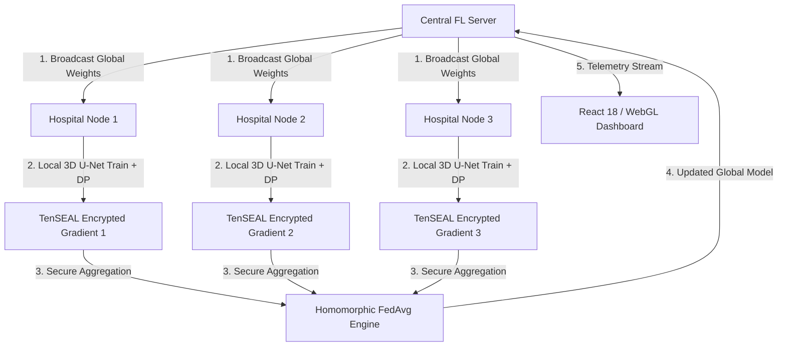
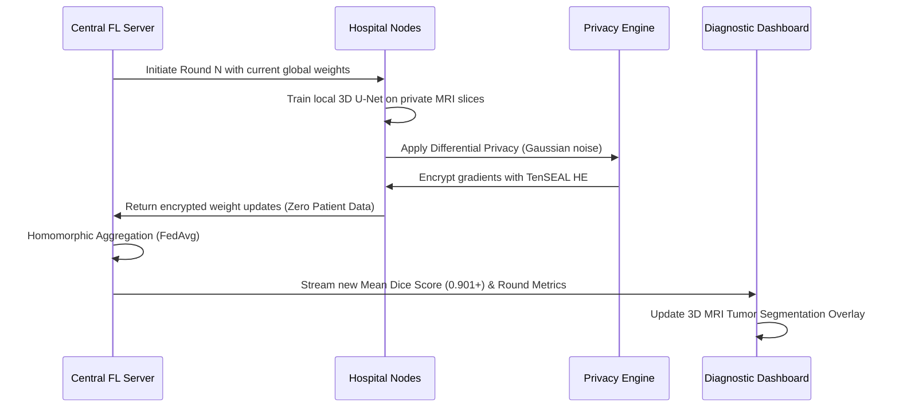

# FedMed

<div align="center">

### Privacy-Preserving Medical Federated Learning Platform

Collaborative 3D MRI brain tumor segmentation across multi-hospital networks with zero patient data leakage.

[](#tech-stack)
[](#tech-stack)
[-FF6F00?style=for-the-badge)](#architecture)
[](#architecture)
[](#features)
[](#features)
[](#quick-start)

[](https://github.com/sunbyte16)
[](https://github.com/ymp7)
[](https://www.linkedin.com/in/sunil-kumar-bb88bb31a/)
[](https://www.linkedin.com/in/yegireddy-monish-prasanna/)
[](https://lively-dodol-cc397c.netlify.app)

</div>

**FedMed** is an enterprise-grade, privacy-first Federated Learning platform engineered for collaborative medical imaging and volumetric 3D MRI brain tumor segmentation. By sending the AI model to hospital nodes rather than centralizing patient records, FedMed enables multi-institutional diagnostic research while maintaining strict HIPAA and GDPR compliance with mathematical zero-data-leakage guarantees.

It combines:

- Decentralized Federated Averaging (FedAvg) over gRPC with mTLS
- Volumetric 3D U-Net neural network architecture for brain tumor segmentation
- Dual-layer privacy: Calibrated Differential Privacy + TenSEAL Homomorphic Encryption
- Interactive WebGL 3D MRI multi-planar slice reconstruction viewer
- Byzantine-resilient node synchronization and immutable audit logs

## Features

- **Decentralized Multi-Hospital Training**: orchestrates federated training rounds across distributed hospital nodes (Metro General, St. Jude, Mayo Research, Johns Hopkins).
- **Dual-Layer Privacy Engine**:
  - *Differential Privacy (DP)*: Injects calibrated Gaussian noise (ε=1.2, δ=10⁻⁵) to prevent model inversion and membership inference attacks.
  - *Homomorphic Encryption (HE)*: Uses Paillier and TenSEAL encrypted gradient aggregation so the central aggregator never decrypts individual weights.
- **Interactive 3D MRI Viewer**: real-time axial, sagittal, and coronal volumetric slice navigation with tumor contour overlays (Necrotic Core, Enhancing Tumor, Edema).
- **Byzantine Fault Tolerance**: outlier client weight filtering and dynamic node reputation scoring.
- **Enterprise Regulatory Compliance**: immutable audit trails designed to meet HIPAA Security Rules (45 CFR § 164.312) and GDPR Article 25.

## Tech Stack

| Layer | Technologies |
|---|---|
| Frontend | React 18, TypeScript, Vite, Tailwind CSS, WebGL, Lucide Icons |
| Backend & FL | Python 3.10+, Flower (FL), PyTorch, gRPC, Protocol Buffers |
| Cryptography & Privacy | TenSEAL, Paillier Homomorphic Encryption, PyVenn, NumPy |
| Database & State | SQLite, Express API gateway, WebSocket telemetry |
| DevOps | Docker, Docker Compose |

## Architecture

```text
                           FEDMED PLATFORM ARCHITECTURE

                            +----------------------+
                            |   Central FL Server  |
                            | Federated Aggregator |
                            +----------+-----------+
                                       |
                   Encrypted Weights   |   gRPC / mTLS
                   Homomorphic Agg     |   Global Model Broadcast
                                       v
+-------------------------------------------------------------------------------+
|                            FEDERATED CLIENT NODES                             |
|                                                                               |
|  +--------------------+  +--------------------+  +--------------------+       |
|  |  Hospital Node A   |  |  Hospital Node B   |  |  Hospital Node C   |  ...  |
|  |  Local MRI Dataset |  |  Local MRI Dataset |  |  Local MRI Dataset |       |
|  |  (Behind Firewall) |  |  (Behind Firewall) |  |  (Behind Firewall) |       |
|  +---------+----------+  +---------+----------+  +---------+----------+       |
|            |                       |                       |                  |
|            v                       v                       v                  |
|  +--------------------------------------------------------------------+       |
|  |                     Local 3D U-Net Training Engine                 |       |
|  |  • PyTorch Volumetric Convolutional Layers                         |       |
|  |  • Differential Privacy Perturbation Engine (Gaussian Noise)       |       |
|  |  • TenSEAL Homomorphic Encryption Context                          |       |
|  +--------------------------------------------------------------------+       |
+--------------------------------------+----------------------------------------+
                                       |
                                       v
+-------------------------------------------------------------------------------+
|                       WEBGL 3D MRI DIAGNOSTIC CLIENT                          |
|                                                                               |
|  • Axial / Sagittal / Coronal Multi-Planar Slice Reconstruction               |
|  • Real-Time Segmentation Mask Contours (Dice Score: 0.901+)                  |
|  • Live Federated Round Telemetry & HIPAA Audit Logs                          |
+-------------------------------------------------------------------------------+
```

### System Flow



### Request & Round Lifecycle



## Quick Start

### Prerequisites

- Node.js 20+
- Python 3.10+
- PyTorch with CUDA (optional for GPU acceleration)

### 1. Configure Environment

```bash
cp .env.example .env
```

### 2. Start the Development Engine & Dashboard

```bash
# Install dependencies
npm install

# Launch FedMed Engine and UI
npm run dev
```

The application will be accessible at:
- **Web UI & 3D Viewer**: `http://localhost:3000`
- **Health Endpoint**: `http://localhost:3000/api/health`
- **Cluster Overview API**: `http://localhost:3000/api/overview`

## Local Development & Docker

### Docker Compose Cluster

To launch the multi-node federated simulation in isolated containers:

```bash
docker compose -f docker/docker-compose.yml up --build
```

### Running Unit & Engine Tests

```bash
npm test
```

## Core API Endpoints

| Method | Endpoint | Description |
|---|---|---|
| `GET` | `/api/health` | Health and node heartbeat status |
| `GET` | `/api/overview` | Active hospital nodes, rounds, and Mean Dice score |
| `GET` | `/api/nodes` | List connected hospital nodes and local parameters |
| `POST` | `/api/training/start` | Trigger a new federated learning round |
| `GET` | `/api/privacy/config` | Fetch Differential Privacy & HE encryption parameters |
| `GET` | `/api/audit/logs` | Immutable audit trail for HIPAA/GDPR validation |

## Project Structure

```text
FedMed/
├── hospital_nodes/       Hospital client node logic and local data loaders
├── fl_server/            Central federated aggregator and strategy algorithms
├── models/               3D U-Net volumetric segmentation neural network
├── encryption/           TenSEAL and Paillier homomorphic encryption modules
├── grpc/                 Protocol buffer definitions and gRPC service stubs
├── src/                  React 18 frontend components and 3D MRI viewer
├── docker/               Multi-node Dockerfiles and docker-compose configurations
├── Docs/                 Architecture, PRD, and regulatory compliance docs
└── README.md
```

## Connect With Us

### Sunil Sharma
- GitHub: [@sunbyte16](https://github.com/sunbyte16)
- LinkedIn: [Sunil Sharma](https://www.linkedin.com/in/sunil-kumar-bb88bb31a/)
- Portfolio: [lively-dodol-cc397c.netlify.app](https://lively-dodol-cc397c.netlify.app)

### Monish Prasanna
- GitHub: [@ymp7](https://github.com/ymp7)
- LinkedIn: [Monish Prasanna](https://www.linkedin.com/in/yegireddy-monish-prasanna/)

## Creators

<div align="center">

### Crafted By ♥  𝕊𝕦𝕟𝕚𝕝 𝕊𝕙𝕒𝕣𝕞𝕒 & 𝕄𝕠𝕟𝕚𝕤𝕙 ℙ𝕣𝕒𝕤𝕒𝕟𝕟𝕒

</div>

## License

Proprietary - AXLERO SOLUTIONS
