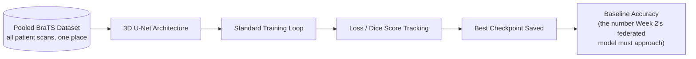
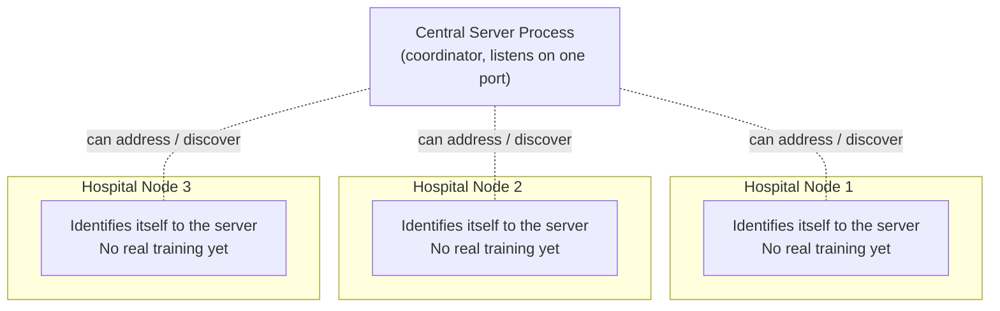

# Week 1 — Centralized Baseline & Node Scaffolding

**Phase:** Foundation Week
**Focus Areas:** Medical Computer Vision (PyTorch/MONAI) + Distributed Systems Scaffolding (Flower)
**Status:** 🚧 In Progress
---

## Table of Contents

- [Overview](#overview)
- [Why We Start Here](#why-we-start-here)
- [Week 1 Goals](#week-1-goals)
- [Conceptual Flow](#conceptual-flow)
- [Track A — Centralized Baseline](#track-a--centralized-baseline-ppml-engineering)
- [Track B — Node Scaffolding](#track-b--node-scaffolding-distributed-systems)
- [System Snapshot at End of Week 1](#system-snapshot-at-end-of-week-1)
- [Day-by-Day Breakdown](#day-by-day-breakdown)
- [Deliverables Checklist](#deliverables-checklist)
- [Success Criteria](#success-criteria)
- [What Week 1 Deliberately Does NOT Do](#what-week-1-deliberately-does-not-do)
- [Looking Ahead to Week 2](#looking-ahead-to-week-2)

---

## Overview

Week 1 lays the two independent foundations that every later week builds on
top of. Nothing federated, encrypted, or distributed-in-the-real-sense
happens yet — and that's intentional. Before we can prove that a federated,
encrypted model is *as good as* a normal one, we need a normal one to
compare against. And before we can orchestrate three hospitals training
together, we need three hospitals that can even talk to a server at all.

So Week 1 splits into two parallel, deliberately *decoupled* tracks:

| Track | Question It Answers | Output |
|---|---|---|
| **A — Centralized Baseline** | "What's the best this model can possibly do if we cheated and pooled all the data?" | A single accuracy/Dice number — the ceiling everything later gets measured against |
| **B — Node Scaffolding** | "Can three independent hospital processes exist, run separately, and be individually addressable?" | 3 running mock nodes on distinct ports, with no real training logic yet |

By the end of the week these two tracks don't merge yet — that happens in
Week 2. Week 1 is about proving each half works in isolation first.

## Why We Start Here

A common mistake in FL projects is jumping straight to the federated loop
without ever establishing what "good" looks like. If the federated model
converges to 60% Dice score, is that good or bad? Without a centralized
baseline trained on the same data, there's no way to know. Every claim this
project makes later — "the federated model nearly matches centralized
performance," "encryption didn't hurt accuracy," "differential privacy cost
us X% Dice score" — is only meaningful *relative to* the number we lock in
this week.

Similarly, debugging a federated system is dramatically harder than
debugging a single-process one. If node scaffolding, port binding, and
server↔client discovery aren't solid before any real ML logic is added,
every future bug becomes ambiguous: is it a model bug or a networking bug?
Week 1 removes that ambiguity by getting the "plumbing" working first, with
trivial/no-op logic inside it.

## Week 1 Goals

```
┌─────────────────────────────────────────────────────────────┐
│                        WEEK 1 GOALS                          │
├───────────────────────────────┬───────────────────────────────┤
│         TRACK A                │          TRACK B               │
│   PPML Engineering             │   Distributed Systems          │
├───────────────────────────────┼───────────────────────────────┤
│ ✅ Acquire & prepare BraTS      │ ✅ Install & configure Flower   │
│    MRI dataset subset           │                                 │
│ ✅ Design 3D U-Net              │ ✅ Define 3 "Hospital Node"     │
│    architecture (MONAI)          │    identities                  │
│ ✅ Train on full pooled data     │ ✅ Bind each node to a         │
│                                    │    distinct local port         │
│ ✅ Record baseline Dice score    │ ✅ Confirm server can reach     │
│    as the reference ceiling      │    each node individually       │
└───────────────────────────────┴───────────────────────────────┘
```

## Conceptual Flow

```
                    ┌───────────────────────────┐
                    │      Public MRI Dataset     │
                    │           (BraTS)            │
                    └──────────────┬───────────────┘
                                   │
                                   ▼
                    ┌───────────────────────────┐
                    │   TRACK A: Centralized      │
                    │   Baseline Training          │
                    │                               │
                    │   3D U-Net (MONAI/PyTorch)   │
                    │   trained on FULL dataset      │
                    │   (no privacy constraints —    │
                    │    this is the "cheat mode"    │
                    │    reference number)            │
                    └──────────────┬───────────────┘
                                   │
                                   ▼
                    ┌───────────────────────────┐
                    │   Baseline Dice Score        │
                    │   "the ceiling"               │
                    │   e.g. Dice ≈ 0.85 (target)   │
                    └───────────────────────────┘


                    ┌───────────────────────────┐
                    │   TRACK B: Node Scaffolding  │
                    │                               │
                    │        Central Server          │
                    │      (Flower — not yet          │
                    │       doing real FL rounds)     │
                    └──────────────┬───────────────┘
                                   │  handshake only
                     ┌─────────────┼─────────────┐
                     ▼             ▼             ▼
              ┌───────────┐ ┌───────────┐ ┌───────────┐
              │ Hospital 1 │ │ Hospital 2 │ │ Hospital 3 │
              │ port 8081  │ │ port 8082  │ │ port 8083  │
              │ (empty      │ │ (empty      │ │ (empty      │
              │  shell)     │ │  shell)     │ │  shell)     │
              └───────────┘ └───────────┘ └───────────┘

     Tracks A and B do NOT connect yet — that merge is Week 2's job.
```

## Track A — Centralized Baseline (PPML Engineering)

**Goal:** Train a standard 3D U-Net on a public MRI dataset (BraTS) to
establish a baseline accuracy metric.

### What this involves conceptually

- **Dataset acquisition** — sourcing a subset of the BraTS (Brain Tumor
  Segmentation) dataset, a well-known public benchmark of multi-modal MRI
  scans with expert-labeled tumor regions. Using a public dataset for the
  baseline (rather than any real patient data) is itself a nod to the
  project's privacy-first spirit — no real PHI touches this repo at any
  point, even in the "centralized cheat mode."
- **Architecture selection** — a 3D U-Net is chosen specifically because
  MRI scans are volumetric (a stack of 2D slices forming a 3D volume, not
  a single flat image). A standard 2D CNN would need to process each slice
  independently and lose the spatial relationships *between* slices — a 3D
  U-Net's encoder-decoder structure with 3D convolutions preserves that
  volumetric context, which is essential for accurately outlining a tumor
  that spans many slices.
- **Baseline training run** — this model is trained the "easy way": on the
  *entire* dataset, pooled together, with no data partitioning and no
  privacy constraints. This is deliberately the least private, most
  accurate-in-theory setup possible — the whole point is to establish the
  performance ceiling that the much harder federated + encrypted + noised
  approach will be measured against in later weeks.
- **Metric recording** — the resulting Dice similarity coefficient (the
  standard metric for segmentation overlap quality) becomes the single
  number referenced throughout the rest of the project's documentation and
  README results table.

### Why Dice score specifically

Unlike simple pixel-accuracy, Dice score is robust to class imbalance —
tumors typically occupy a small fraction of a brain scan's total volume, so
a model that just predicts "no tumor everywhere" could still get very high
pixel accuracy while being clinically useless. Dice score directly
penalizes that failure mode, which is why it's the standard metric across
nearly all medical segmentation literature (including the BraTS challenge
itself).

## Track B — Node Scaffolding (Distributed Systems)

**Goal:** Set up the Flower framework. Configure 3 distinct mock "Hospital
Nodes" running on separate local ports.

### What this involves conceptually

- **Framework installation** — Flower is chosen as the federated learning
  orchestration layer because it's framework-agnostic (works directly with
  standard PyTorch models, no rewrite required) and has a mature simulation
  mode well suited to running multiple "hospitals" on a single development
  machine before any real multi-machine deployment.
- **Node identity design** — each hospital is modeled as its own
  independent process/client identity, conceptually representing a
  separate institution with its own infrastructure, its own port, and
  (eventually) its own private data store that no other node or the server
  can see into.
- **Port isolation** — running each node on a distinct local port simulates
  the reality of three genuinely separate machines, even while developing
  on one laptop. This is what makes the "cross-silo" simulation meaningful
  rather than just a single process pretending to be three.
- **Server↔node handshake** — before any real training logic exists, the
  server needs to be able to discover and address each node individually.
  Proving this handshake works with trivial/empty client logic isolates
  networking correctness from ML correctness — if something breaks in
  Week 2 once real training logic is added, it's immediately clear the bug
  is in the *new* code, not the underlying plumbing.

### Why simulate hospitals as separate processes rather than one script

A single script that just loops over three data folders would be far
simpler to write — but it would completely fail to demonstrate the actual
distributed-systems challenge this project is about: independent parties
that cannot see each other's internal state, that can fail independently,
and that must be coordinated over a network rather than a function call.
Running genuinely separate processes on separate ports from Day 1 is what
makes Week 2's "node resilience" test (surviving a node dropping mid-round)
a real test rather than a simulated one.

## System Snapshot at End of Week 1

```
┌──────────────────────────────────────────────────────────────────┐
│                      END-OF-WEEK-1 SNAPSHOT                       │
├──────────────────────────────────────────────────────────────────┤
│                                                                     │
│   TRACK A (isolated)              TRACK B (isolated)              │
│   ┌─────────────────────┐          ┌─────────────────────┐        │
│   │  3D U-Net model       │          │   Flower Server       │      │
│   │  trained centrally     │          │   (idle / handshake    │      │
│   │                         │          │    mode only)           │      │
│   │  Baseline Dice: X.XX   │          │                         │      │
│   └─────────────────────┘          │   Hospital Node 1 :8081 │      │
│                                       │   Hospital Node 2 :8082 │      │
│   ↑ This number becomes the           │   Hospital Node 3 :8083 │      │
│     reference ceiling for ALL         └─────────────────────┘        │
│     future weeks' results tables            ↑                        │
│                                        Proven: server can reach       │
│                                        each node independently        │
│                                                                        │
│   Not yet connected. Not yet federated. Not yet encrypted.            │
│   That merge begins Week 2.                                           │
└──────────────────────────────────────────────────────────────────┘
```

## Day-by-Day Breakdown

| Day | Track | Focus | Outcome |
|---|---|---|---|
| **1** | Setup | Repository structure, environment, dependency planning | Clean scaffold, reproducible setup |
| **2** | A | Source & prepare BraTS MRI subset | Documented, reproducible `data/` layout |
| **3** | A | Design the 3D U-Net architecture | Model definition ready to reuse in every future hospital node |
| **4** | A | Run centralized training | First baseline metrics logged |
| **5** | A | Finalize & document baseline results | Reference Dice score locked in, checkpoint saved |
| **6** | B | Scaffold the Flower central server | Server process runs, awaiting clients |
| **7** | B | Stand up 3 mock hospital nodes on separate ports | Server↔node handshake confirmed for all 3 |

## Deliverables Checklist

- [ ] BraTS MRI subset downloaded, preprocessed, and documented
- [ ] 3D U-Net architecture defined (reusable design, not yet duplicated per node)
- [ ] Centralized baseline training completed on full pooled dataset
- [ ] Baseline Dice score recorded and committed to project documentation
- [ ] Model checkpoint from baseline run saved
- [ ] Flower framework installed and configured
- [ ] Central server process scaffolded and runnable
- [ ] 3 mock hospital nodes defined, each bound to its own distinct port
- [ ] Server confirmed able to individually address/reach each of the 3 nodes

## Success Criteria

Week 1 is considered complete when **both tracks independently succeed**,
even though they aren't connected to each other yet:

- **Track A success:** a single, documented, reproducible baseline Dice
  score exists and is saved alongside its model checkpoint — this number
  does not need to be state-of-the-art, it needs to be *trustworthy*, since
  every later comparison in this project depends on it.
- **Track B success:** the central server can start up and successfully
  discover/handshake with all 3 hospital nodes running on their separate
  ports, with zero real training logic required yet — pure connectivity
  proof.

## What Week 1 Deliberately Does NOT Do

To keep scope honest and avoid Week 1 quietly ballooning into Week 2's
work, the following are explicitly **out of scope** this week:

- ❌ No data partitioning across hospitals yet (all data stays pooled for
  the baseline)
- ❌ No real local training happening inside the mock hospital nodes yet
- ❌ No FedAvg or any aggregation logic yet
- ❌ No encryption, TLS, or differential privacy yet
- ❌ No dashboard or metrics streaming yet

Each of these is intentionally deferred to the week where it's the primary
focus, so that Week 1's two tracks stay small, provable, and easy to
verify in isolation.

## Looking Ahead to Week 2

With a trustworthy baseline number and three independently addressable
hospital nodes in place, Week 2 is where the two tracks finally meet: the
dataset gets partitioned across the three nodes for real, the server
begins broadcasting actual model weights and aggregating real updates
(FedAvg), and the transport layer gets locked down with TLS. Week 2 also
carries the project's **mid-project review** — the point where we first
get to ask, with real numbers, "does the federated version actually
approach the centralized baseline we just established?"

---

# Week 1 — Centralized Baseline & Node Scaffolding
### FedMed: Cross-Silo Federated Learning Engine

---

## 1. Week 1 Objective

Before any federation, privacy, or encryption work begins, Week 1 exists to answer two foundational questions:

1. **"Can our model even solve this problem?"** — Train a standard (non-federated) 3D U-Net on a public MRI dataset (BraTS) to get a real accuracy number. This becomes the **benchmark** every later, privacy-preserving version of the model must be compared against.
2. **"Can our distributed skeleton stand up?"** — Before wiring real encrypted communication, get the shape of the system in place: one central server process and three independent "hospital" processes that can be started, addressed, and identified separately.

Everything built this week is deliberately simple. No encryption, no real federation logic, no security — those are Week 2 and Week 3. Week 1 is about **proving the two halves of the system independently** before joining them.

---

## 2. Two Parallel Tracks

| Track | Owner Concern | What "Done" Looks Like by End of Week 1 |
|---|---|---|
| **PPML Engineering** | Is the model architecture and training pipeline correct? | A centralized 3D U-Net trained on pooled BraTS data, with a recorded baseline accuracy/Dice score |
| **Distributed Systems** | Can the federated topology exist at all? | 3 mock "hospital node" processes running independently on separate ports, aware of a central coordinator address |

These two tracks don't talk to each other yet. They merge in **Week 2**, when the *same* model architecture proven in Track 1 gets deployed inside the node processes scaffolded in Track 2, and starts actually training on data instead of just booting up.

---

## 3. Why This Order Matters

A federated learning system has two independent sources of failure:
- The **model** might not be able to learn the task at all (bad architecture, bad preprocessing, bad hyperparameters).
- The **distributed infrastructure** might not be able to coordinate reliably (nodes can't connect, ports conflict, one node hangs the whole round).

If both are built and tested *together* from day one, a failure could come from either side and debugging becomes guesswork. By isolating them in Week 1 — prove the model works centrally, prove the nodes can boot and be addressed separately — Week 2's federated integration only has to test **one new thing**: the communication and aggregation logic itself.

---

## 4. Conceptual Flow — Centralized Baseline



**Why this step is allowed to pool data:** this is the *only* point in the entire project where data is centralized — deliberately, and only for benchmarking purposes on a public dataset. From Week 2 onward, this pattern is never repeated with real patient data; every subsequent training step happens locally inside a hospital's own environment.

---

## 5. Conceptual Flow — Node Scaffolding



At this stage, each "hospital" is really just a separate, isolated process — simulating three different physical hospitals on three different local ports. The point of Week 1 is only to prove these three processes can run **simultaneously and independently** and be individually addressable by a coordinator. Real local training, encrypted communication, and secure channels are intentionally absent — they're the entire subject of Weeks 2 and 3.

---

## 6. Week 1 Deliverables (Descriptive)

| Deliverable | Description |
|---|---|
| **Baseline Model Definition** | A written specification of the 3D U-Net architecture: input = 4-channel MRI volume (T1, T1ce, T2, FLAIR), output = 4-class voxel segmentation (background, necrotic core, edema, enhancing tumor), following BraTS labeling convention |
| **Baseline Training Report** | A record of the centralized training run — dataset size used, number of epochs, final loss curve behavior, and best validation Dice score achieved. This becomes the reference number for the Mid-Project Review's federated audit |
| **Node Topology Design** | A description of how three hospital nodes and one central coordinator are logically separated — each node representing an isolated environment with its own (simulated) private data, reachable only via its assigned port |
| **Project Repository Structure** | The folder layout that organizes model logic, node logic, server logic, data handling, and documentation into clearly separated concerns, so Week 2's federation work has a clean place to land |

---

## 7. Suggested Repository Structure (Descriptive)

```
fedmed/
├── README.md                # Full project overview, architecture, week-wise plan
├── requirements.txt         # Dependency manifest
├── .gitignore                # Excludes patient data, checkpoints, secrets
├── model/                    # Everything related to the shared ML architecture
│   ├── (dataset handling description)
│   ├── (3D U-Net architecture description)
│   └── (centralized training loop description)
├── node/                     # Everything related to a single hospital's process
│   └── (hospital node scaffold description)
├── server/                    # Everything related to the central coordinator
│   └── (server scaffold description)
├── data/                      # Local-only, gitignored — never committed
└── docs/
    └── week1_summary.md       # This document
```

---

## 8. Week 1 → Week 2 Handoff

| What Week 1 Proves | What Week 2 Builds On Top of It |
|---|---|
| The 3D U-Net architecture can learn tumor segmentation at all | The *same* architecture is instantiated independently inside each hospital node |
| A baseline accuracy number exists | Federated training is judged against this number in the Mid-Project "Federated Audit" |
| Three node processes can run and be addressed independently | Real data partitioning, local training, and FedAvg aggregation are added between them |
| A central coordinator process exists | The coordinator gains the actual broadcast → collect → aggregate round logic |

---

## 9. Suggested Daily Commit Breakdown (Descriptive Only)

| Day | Focus | What the Commit Represents |
|---|---|---|
| 1 | Repository Initialization | Project structure, README, dependency manifest, and ignore rules established |
| 2 | Dataset Understanding | Description/documentation of how BraTS MRI data is structured and will be consumed |
| 3 | Model Architecture Definition | Written specification of the 3D U-Net design and its inputs/outputs |
| 4 | Training Strategy | Documentation of the loss function, evaluation metric (Dice score), and training loop design |
| 5 | Baseline Results | Recorded outcome of the centralized training run — the benchmark accuracy |
| 6 | Node Topology | Documentation of the three-node, one-coordinator scaffold design and port assignments |
| 7 | Week 1 Review | Summary document tying both tracks together and stating what's carried into Week 2 |

---

## 10. Key Takeaway for Week 1

Week 1 is a **proof of feasibility**, not a proof of privacy. It answers: *"Can this model learn the task, and can this many independent nodes exist side by side?"* Every privacy guarantee — encrypted communication, homomorphic aggregation, differential privacy — is layered on **top of** this foundation starting Week 2. Nothing in Week 1 involves real patient data or real inter-node communication of model weights; both are simulated or absent, by design.

📌 *This document is part of the FedMed daily-commit build log. See
[docs/WEEKLY_PLAN.md](WEEKLY_PLAN.md) for the full 4-week roadmap and
[docs/ARCHITECTURE.md](ARCHITECTURE.md) for system-wide design details.*
