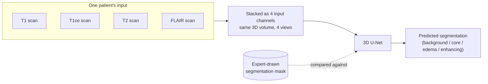
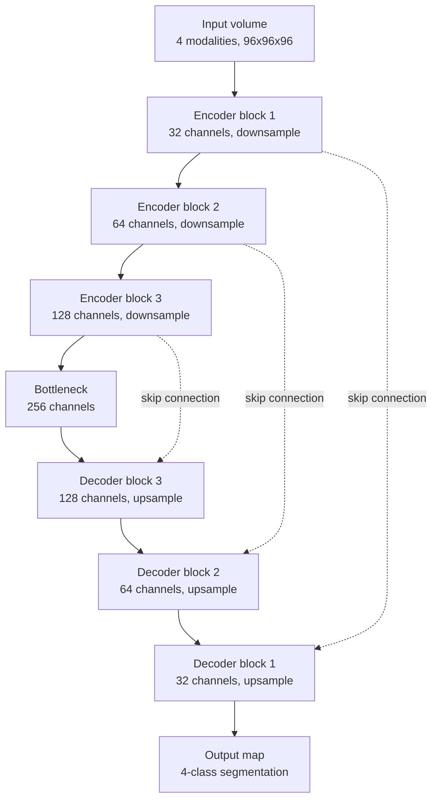
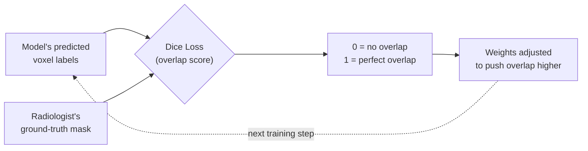
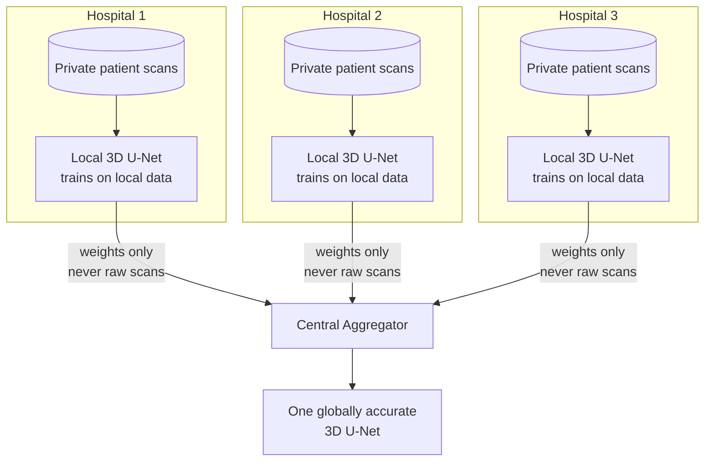

# Dataset & Model — What FedMed Trains and Why
### FedMed: Cross-Silo Federated Learning Engine

---

## 0. Visual References

Let me pull up some visual references to make this concrete.

*(Note: the original chat pulled up real BraTS example photos via image search. Those are copyrighted stock/paper images and can't be redistributed in this repo, so the schematic below is an original illustration built to convey the same concept — how the four modalities and the segmentation mask relate to each other.)*

The panels above show what one patient's data conceptually looks like: **four different MRI scans of the same brain**, taken with different imaging settings (called "modalities"), plus the ground-truth tumor outline drawn by radiologists — the necrotic core, edema, and enhancing tumor regions each in a different color.

---

## 1. The Dataset — BraTS (Brain Tumor Segmentation Challenge)

FedMed uses **BraTS**, a public benchmark dataset of brain MRI scans with expert-drawn tumor outlines, to simulate the kind of data real hospitals would hold locally.

### 1.1 Four Modalities Per Patient

No single MRI scan tells the full story of a tumor. Each patient in BraTS is scanned **four different ways**, and all four are used together as input:

| Modality | What it highlights |
|---|---|
| **T1** | Basic anatomical structure |
| **T1ce** (T1 contrast-enhanced) | Tumor core lights up brightest — a contrast dye is injected before the scan |
| **T2** | Fluid and edema (swelling) show up brighter |
| **FLAIR** | Suppresses normal fluid signal so edema stands out even more clearly |

A radiologist has to look at all four together to accurately outline a tumor — which is exactly why the model is designed to take all 4 as simultaneous input channels rather than looking at one scan at a time.

### 1.2 The Ground-Truth Label

Alongside the four scans, each patient has a **segmentation mask** — a voxel-by-voxel map where an expert has labeled every part of the tumor:

| Label | Meaning |
|---|---|
| 0 | Healthy background tissue |
| 1 | Necrotic / non-enhancing tumor core (dead tissue at the tumor's center) |
| 2 | Edema (swelling around the tumor) |
| 3 | Enhancing tumor (the actively growing, contrast-absorbing rim) |

### 1.3 3D, Not 2D

Each scan is a **volume**, not a flat photo — roughly 150 stacked 2D slices forming a cube of the whole brain, stored in the standard medical imaging format (NIfTI, `.nii.gz`). This is why the model architecture has to work in three dimensions rather than treating each slice independently — tumors span multiple slices, and stacking context across neighboring slices matters for an accurate boundary.

---

## 2. The Model — 3D U-Net

Let me sketch the architecture so it's concrete rather than abstract.

Now let me sketch the U-Net architecture itself:

The architecture is a **U-Net**: an encoder-decoder network with a distinctive feature — skip connections — that make it especially good at pixel-precise (voxel-precise) medical segmentation. The same structure is shown below as a flowchart for quick reference.

### 2.1 Encoder Path (left/top half)

Each encoder block shrinks the volume spatially — halving resolution each step, like zooming out — while increasing the number of feature channels. This is where the network learns **what** is in the image: general patterns like "this looks like tumor tissue." The tradeoff is that fine spatial detail gets lost as the volume compresses.

### 2.2 Bottleneck

The most compressed, most abstract representation of the volume — the network's "big picture" understanding of the whole scan.

### 2.3 Decoder Path (bottom half)

Each decoder block expands the volume back up toward full resolution, trying to answer **where** exactly the tumor boundaries are.

### 2.4 Skip Connections — Why They Matter

Without them, the decoder would have to reconstruct fine detail from the blurry bottleneck alone — like trying to redraw a photo's edges after seeing only a thumbnail. Instead, each encoder block's output is copied directly across to its matching decoder block, handing back the sharp, high-resolution detail needed to draw an accurate tumor boundary. This single design choice is the main reason U-Net-style models outperform plain encoder-decoder networks on medical segmentation tasks.

---

## 3. What We Are Actually Training The Model To Do

This is **not** a classification task ("does this scan contain a tumor, yes/no"). It's **dense voxel-wise segmentation**: for every single 3D pixel (voxel) in the scan — millions of them — the model predicts which of the 4 classes (background, necrotic core, edema, enhancing tumor) that voxel belongs to.

**Training signal:** the model's voxel-by-voxel prediction is compared against the radiologist-drawn ground truth using **Dice loss** — a metric measuring how much the predicted tumor shape overlaps with the real one. Over many training epochs, the network's weights are adjusted to push that overlap score higher.

---

## 4. Why This Matters for FedMed

Manually contouring a brain tumor across roughly 150 MRI slices takes a radiologist meaningful time per patient. A model that can do this automatically — accurately enough to match expert-drawn boundaries — speeds up diagnosis and treatment planning.

But training a model well enough to be trustworthy requires seeing tumors from **many patients across many hospitals** — and that's exactly the data no single hospital is allowed to share under HIPAA/GDPR.

This is the core reason FedMed's federated approach exists: each hospital trains this same 3D U-Net **locally**, on its own patients, using its own private data. Only the **learned weights** — never the scans themselves — travel out of the hospital, to be combined into one globally accurate model.

---

## 5. Summary

| Question | Answer |
|---|---|
| **What data?** | BraTS — public brain MRI scans, 4 modalities per patient, with expert tumor outlines |
| **What model?** | 3D U-Net — encoder-decoder with skip connections, built for volumetric medical imaging |
| **What are we training it to do?** | Predict a 4-class label (background, necrotic core, edema, enhancing tumor) for every voxel in the scan |
| **How is it judged?** | Dice loss — overlap between predicted and expert-drawn tumor shape |
| **Why federated?** | The model needs data from many hospitals to generalize well, but patient scans legally can't leave any single hospital — only trained weights can |
