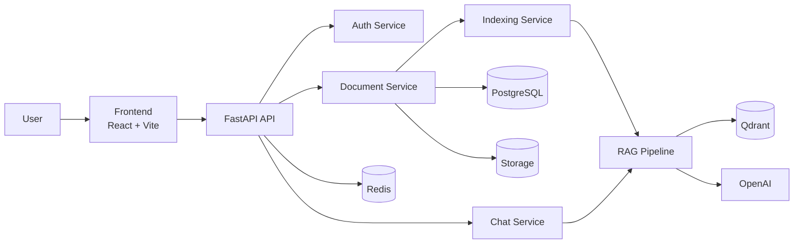
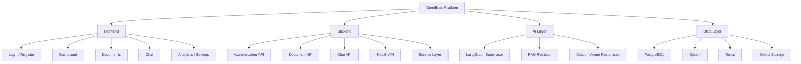
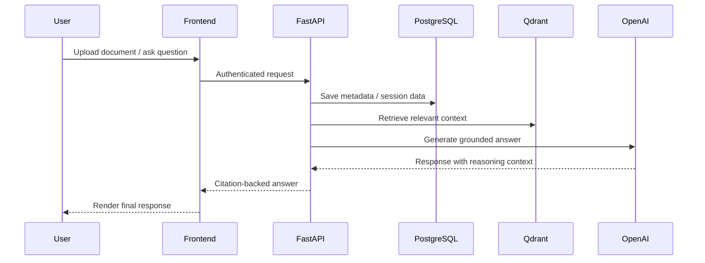

# OmniBrain

<div align="center">

### Enterprise Agentic Multi-Modal RAG Platform

Upload documents, index knowledge, chat with grounded AI, and receive citation-backed answers through a modern full-stack architecture.

[](#tech-stack)
[](#tech-stack)
[](#tech-stack)
[](#architecture)
[](#architecture)
[](#features)
[](#quick-start)

[](https://github.com/sunbyte16)
[](https://github.com/ymp7)
[](https://www.linkedin.com/in/sunil-kumar-bb88bb31a/)
[](https://www.linkedin.com/in/yegireddy-monish-prasanna/)
[](https://lively-dodol-cc397c.netlify.app)

</div>

**OmniBrain** is an enterprise-ready, AI-powered Retrieval-Augmented Generation (RAG) platform that helps teams securely search, understand, and interact with documents using intelligent AI agents. It delivers accurate, context-aware answers, supports multiple data types, and automates workflows with enterprise-grade security and scalability.

It combines:

- Document upload and indexing
- Authentication and protected workspaces
- Citation-aware AI responses
- Agentic orchestration with LangGraph
- PostgreSQL for application data
- Qdrant for vector search
- Redis for caching and fast distributed support

## Features

- **Secure Authentication**: user registration, login, JWT-based auth, RBAC, and rate limiting
- **Document Intelligence**: upload PDFs, DOCX, TXT, CSV, XLSX, and image files with paragraph/sentence-aware semantic chunking
- **Grounded Agentic Chat**: ask questions over uploaded content with strict `[Source: Document <id>, Page: <page>]` citation enforcement
- **Modern UI**: responsive React dashboard powered by React Query, Zustand, and Tailwind CSS
- **Scalable Backend**: async FastAPI services designed for containerized deployment
- **Automated Test Isolation**: session-isolated Pytest suite using temporary dynamic SQLite engines
- **Enterprise Foundation**: clean architecture, modular services, `.env.example` templates, and deployment-ready infrastructure

## Tech Stack

| Layer | Technologies |
|---|---|
| Frontend | React, TypeScript, Vite, Tailwind CSS, React Query, Zustand |
| Backend | FastAPI, Python 3.12, SQLAlchemy, Pydantic |
| AI / Orchestration | LangGraph, LangChain, OpenAI |
| Data | PostgreSQL, Qdrant, Redis |
| DevOps | Docker, Docker Compose |

## Architecture

```text
                          OMNIBRAIN ARCHITECTURE

                            +----------------------+
                            |       Users          |
                            | Web | Mobile | API   |
                            +----------+-----------+
                                       |
                                       v
+------------------------------------------------------------------+
|                         FRONTEND (React)                         |
| React + TypeScript + Vite + Tailwind CSS                         |
| Components:                                                      |
| • Authentication                                                 |
| • Dashboard                                                      |
| • Chat Interface                                                 |
| • Document Upload                                                |
| • Search                                                         |
| • Settings                                                       |
+------------------------------+-----------------------------------+
                               |
                               | REST API / WebSocket
                               v
+------------------------------------------------------------------+
|                     BACKEND (FastAPI + Python)                   |
|                                                                  |
|  +----------------+  +----------------+  +--------------------+  |
|  | Authentication |  | Document API   |  | Chat API           |  |
|  +----------------+  +----------------+  +--------------------+  |
|                                                                  |
|  +------------------------------------------------------------+  |
|  | Business Logic / Services                                 |  |
|  | • User Management                                         |  |
|  | • File Processing                                         |  |
|  | • Query Processing                                        |  |
|  | • AI Agent Controller                                     |  |
|  +------------------------------------------------------------+  |
+------------------------------+-----------------------------------+
                               |
                               v
+------------------------------------------------------------------+
|                AI ORCHESTRATION (LangGraph)                      |
|                                                                  |
|  User Query                                                      |
|       |                                                          |
|       v                                                          |
|  LangGraph Workflow                                              |
|       |                                                          |
|       +------------> LangChain                                  |
|                             |                                   |
|                             +------------> OpenAI LLM           |
|                                              |                  |
|                                              v                  |
|                                     Generated Response          |
+------------------------------+-----------------------------------+
                               |
                               v
+------------------------------------------------------------------+
|                          DATA LAYER                              |
|                                                                  |
| PostgreSQL  --> Users, Workspaces, Metadata                      |
| Qdrant      --> Vector Embeddings                                |
| Redis       --> Cache & Sessions                                 |
| File Storage--> Uploaded Documents                               |
+------------------------------+-----------------------------------+
                               ^
                               |
+------------------------------------------------------------------+
|                    DOCUMENT INGESTION PIPELINE                   |
|                                                                  |
| Upload Document                                                  |
|        ↓                                                         |
| Parse Text                                                       |
|        ↓                                                         |
| Chunk Document                                                   |
|        ↓                                                         |
| Generate Embeddings (OpenAI)                                     |
|        ↓                                                         |
| Store Vectors in Qdrant                                          |
|        ↓                                                         |
| Save Metadata in PostgreSQL                                      |
+------------------------------+-----------------------------------+
                               |
                               v
+------------------------------------------------------------------+
|                    DEPLOYMENT / DEVOPS                           |
| Docker • Docker Compose                                          |
+------------------------------------------------------------------+
```

### System Flow



### Module Diagram



### Request Lifecycle



## Quick Start

### Prerequisites

- Docker and Docker Compose
- Python 3.12+
- Node.js 18+
- OpenAI API key for embeddings and chat

### 1. Configure Environment

```bash
cp .env.example .env
```

Update your `.env` with required values such as:

- `OPENAI_API_KEY`
- `JWT_SECRET_KEY`
- `APP_SECRET_KEY`

### 2. Start the Full Stack

```bash
docker compose up --build
```

### 3. Access the Services

| Service | URL |
|---|---|
| Frontend | `http://localhost:5173` |
| Backend API | `http://localhost:8000` |
| API Docs | `http://localhost:8000/docs` |
| Qdrant | `http://localhost:6333` |

### 4. Use the Platform

1. Open the frontend
2. Register a new account or seed an admin user
3. Upload documents
4. Wait until document status becomes `indexed`
5. Start chatting with your knowledge base

## Local Development

### Infrastructure Only

```bash
docker compose up postgres redis qdrant -d
```

### Backend

```bash
cd backend
python -m venv .venv
.venv\Scripts\activate
pip install -r requirements.txt
uvicorn app.main:app --reload --port 8000
```

### Running Tests

OmniBrain features a session-isolated test suite using temporary SQLite databases to prevent state accumulation:

```bash
python -m pytest backend/tests/
```

### Frontend

```bash
cd frontend
npm install
npm run dev
```

## Demo Users

### Default Admin

- Email: `admin@omnibrain.io`
- Password: `Admin123!`

### Seed Admin or Bulk Users

```bash
cd backend
python scripts/seed_admin.py
python scripts/seed_admin.py --users-count 1000
```

This is useful for testing registration and login capacity at scale.

## Core API Highlights

| Method | Endpoint | Description |
|---|---|---|
| `GET` | `/api/health` | Health status for core services |
| `POST` | `/api/auth/register` | Register a new user |
| `POST` | `/api/auth/login` | Login and receive JWT tokens |
| `GET` | `/api/auth/me` | Fetch current authenticated user |
| `POST` | `/api/documents` | Upload a document |
| `GET` | `/api/documents` | List uploaded documents |
| `POST` | `/api/chat` | Create a new chat |
| `POST` | `/api/chat/{id}/messages` | Send a message in a chat |

## Project Structure

```text
OmniBrain/
├── backend/          FastAPI application and business logic
├── frontend/         React UI and dashboard
├── agents/           LangGraph agent orchestration
├── rag/              Retrieval-Augmented Generation pipeline
├── ingestion/        Document parsing and chunking
├── embeddings/       Embedding generation services
├── vision/           Vision workflows
├── storage/          Uploaded document storage
├── Docs/             Product and architecture documentation
├── docker-compose.yml
└── README.md
```

## Why OmniBrain

- **Grounded Answers** instead of generic LLM output
- **Citations by Design** for trust and auditability
- **Multi-Modal Foundation** ready for text, tables, and images
- **Scalable Services** with async APIs and container support
- **Clean Developer Experience** with separated frontend, backend, AI, and infra layers

## Roadmap

- Phase 1: Project Foundation
- Phase 2: Authentication
- Phase 3: Document Management
- Phase 4-5: Processing and Embeddings
- Phase 6-7: Agentic RAG
- Phase 8+: Vision, analytics, advanced workflows, and enterprise extensions

For the full roadmap, see `Documents/Phases.md`.

## Connect With Us

### Sunil Sharma
- GitHub: [@sunbyte16](https://github.com/sunbyte16)
- LinkedIn: [Sunil Sharma](https://www.linkedin.com/in/sunil-kumar-bb88bb31a/)
- Portfolio: [lively-dodol-cc397c.netlify.app](https://lively-dodol-cc397c.netlify.app)

### Monish Prasanna
- GitHub: [@ymp7](https://github.com/ymp7)
- LinkedIn: [Monish Prasanna](https://www.linkedin.com/in/yegireddy-monish-prasanna/)

## Creators

<div align="center">

### Crafted By ♥  𝕊𝕦𝕟𝕚𝕝 𝕊𝕙𝕒𝕣𝕞𝕒 & 𝕄𝕠𝕟𝕚𝕤𝕙 ℙ𝕣𝕒𝕤𝕒𝕟𝕟𝕒

</div>

## License

Proprietary - AXLERO SOLUTIONS
