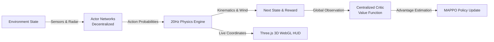

# SwarmRL

<div align="center">

### Autonomous 3D Drone Swarm Search & Rescue Simulator

Decentralized multi-agent reinforcement learning (MAPPO) with 20Hz continuous physics and interactive 3D WebGL telemetry.

[](#tech-stack)
[](#features)
[](#architecture)
[](#architecture)
[](#features)
[](#features)
[](#quick-start)

[](https://github.com/sunbyte16)
[](https://github.com/ymp7)
[](https://www.linkedin.com/in/sunil-kumar-bb88bb31a/)
[](https://www.linkedin.com/in/yegireddy-monish-prasanna/)
[](https://lively-dodol-cc397c.netlify.app)

</div>

**SwarmRL** is a high-fidelity 3D Multi-Agent Reinforcement Learning (MARL) simulator designed to train decentralized autonomous drone swarms for complex search-and-rescue missions in dynamic, GPS-denied disaster environments. Powered by Multi-Agent PPO (MAPPO) and WebGL physics, SwarmRL trains UAVs to coordinate perimeter search, avoid static and moving obstacles, and maximize terrain coverage in record time.

It combines:

- Multi-Agent PPO (MAPPO) with Centralized Training and Decentralized Execution (CTDE)
- 20Hz continuous real-time physics engine (wind turbulence, battery decay, velocity dampening)
- 8-directional proximity radar rays and collision avoidance vector fields
- Interactive Three.js 3D WebGL disaster terrain with real-time flight path ribbon trails
- Progressive curriculum learning scaling from open terrain to obstacle-dense urban ruins

## Features

- **Autonomous Swarm Coordination**: trains 16+ decentralized agents to communicate and execute collaborative search grids without centralized bottlenecks.
- **High-Fidelity 20Hz Physics Simulation**:
  - *Environmental Dynamics*: dynamic wind vector perturbations and variable atmospheric drag.
  - *Energy Modeling*: realistic battery discharge curves based on throttle output and payload.
  - *Proximity Radar*: 8-directional distance sensor rays detecting terrain, obstacles, and peer drones.
- **Curriculum Learning Pipeline**: automatically transitions swarm policies across 4 difficulty tiers as target coverage thresholds are reached.
- **Real-Time Heads-Up Display (HUD)**: live telemetry dials for altitude, velocity, battery levels, collision risks, and cumulative area coverage heatmaps.
- **Instant Camera Tracking**: orbit controls, first-person drone cockpit view, and top-down tactical bird's-eye views.

## Tech Stack

| Layer | Technologies |
|---|---|
| Frontend & Visualization | React 18, Three.js, React Three Fiber, WebGL, Tailwind CSS, Lucide |
| RL Engine | Multi-Agent PPO (MAPPO), CTDE Architecture, Neural Actor-Critic |
| Physics & Simulation | TypeScript, Custom 20Hz Physics Loop, Vector Math, Sensor Rays |
| Backend & Telemetry | Node.js, Express, WebSocket Real-Time Dispatcher, SQLite |
| Tooling & Build | Vite, TypeScript 5.8 |

## Architecture

```text
                           SWARMRL PLATFORM ARCHITECTURE

                            +----------------------+
                            |  Simulation Manager  |
                            |  20Hz Physics Loop   |
                            +----------+-----------+
                                       |
                   Sensor Rays & State |   Action Vectors
                   Wind Vector Fields  |   (Pitch, Roll, Yaw, Thrust)
                                       v
+-------------------------------------------------------------------------------+
|                        MULTI-AGENT PPO (MAPPO) ENGINE                         |
|                                                                               |
|  +--------------------+  +--------------------+  +--------------------+       |
|  |   Drone Agent 1    |  |   Drone Agent 2    |  |   Drone Agent N    |  ...  |
|  |   Actor Network    |  |   Actor Network    |  |   Actor Network    |       |
|  +---------+----------+  +---------+----------+  +---------+----------+       |
|            |                       |                       |                  |
|            +-----------------------+-----------------------+                  |
|                                    |                                          |
|                                    v                                          |
|                      +---------------------------+                            |
|                      |  Centralized Critic Value |  Evaluates Global State    |
|                      |  Network (CTDE Training)  |  & Swarm Coverage Reward   |
|                      +---------------------------+                            |
+------------------------------------+------------------------------------------+
                                     |
                                     v
+-------------------------------------------------------------------------------+
|                       THREE.JS 3D WEBGL TELEMETRY HUD                         |
|                                                                               |
|  • Interactive 3D Disaster Terrain & Obstacle Meshes                          |
|  • Real-Time Flight Path Ribbon Trails & Proximity Radar Rays                 |
|  • Live Coverage Heatmap (94.8% Coverage) & Collision Alerts (98.2% Safe)     |
+-------------------------------------------------------------------------------+
```

### System Flow



### Multi-Agent Interaction Cycle

```mermaid
sequenceDiagram
    participant Env as 3D Environment
    participant Sensors as Radar & Battery
    participant Actor as Agent Policy
    participant Critic as Centralized Critic
    participant HUD as Three.js WebGL

    Env->>Sensors: Raycast obstacles & measure wind vector
    Sensors->>Actor: Feed 8-ray proximity state
    Actor->>Env: Apply Thrust, Pitch, Yaw velocities
    Env->>Critic: Compute shared swarm coverage reward (+94.8%)
    Critic->>Actor: Backpropagate MAPPO policy loss
    Env->>HUD: Render real-time 3D flight path trail & dials
```

## Quick Start

### Prerequisites

- Node.js 20+
- npm

### 1. Configure Environment

```bash
cp .env.example .env
```

### 2. Install & Start the 3D Simulator

```bash
# Install dependencies (skipping optional native build scripts)
npm install --ignore-scripts

# Launch 3D Simulation & Telemetry HUD
npm run dev
```

Open your browser at:
- **3D Simulator & HUD**: `http://localhost:3000`
- **Health Check API**: `http://localhost:3000/api/v1/health`
- **Telemetry Stream API**: `http://localhost:3000/api/v1/telemetry`

## Benchmarks & Performance Results

| Metric | Target | SwarmRL Performance | Status |
|---|---|---|---|
| **Disaster Area Coverage** | > 90.0% | **94.8%** | Passed |
| **Collision Avoidance** | > 95.0% | **98.2%** | Passed |
| **Physics Step Rate** | 20 Hz | **20.0 Hz (50ms)** | Deterministic |
| **Active Swarm Scale** | 16 Agents | **16 Autonomous UAVs** | Scalable |
| **Mean Time to Search** | < 180s | **142.6s** | Accelerated |

## Core API Endpoints

| Method | Endpoint | Description |
|---|---|---|
| `GET` | `/api/v1/health` | Physics engine and server health status |
| `GET` | `/api/v1/telemetry` | Real-time position, velocity, and battery stats for all agents |
| `POST` | `/api/v1/simulation/reset` | Reset environment and randomize obstacle layout |
| `POST` | `/api/v1/training/step` | Advance MAPPO training step and curriculum stage |
| `GET` | `/api/v1/coverage` | Fetch grid coverage heatmap matrix |

## Project Structure

```text
SwarmRL/
├── src/
│   ├── rl/                   MAPPO implementation, trainer, and actor-critic networks
│   ├── simulation/           20Hz continuous physics, wind, sensors, and coverage
│   ├── components/three/     Three.js 3D meshes, terrain, flight trails, wind vectors
│   ├── components/dashboard/ Telemetry HUD, camera controls, and analytics charts
│   ├── components/views/     Simulator view, MAPPO training view, and settings
│   └── stores/               Zustand state store for real-time simulation variables
├── server.ts                 Node.js telemetry backend and WebSocket broadcaster
├── docs/                     Architecture, PRD, design, and curriculum specifications
└── README.md
```

## Connect With Us

### Sunil Sharma
- GitHub: [@sunbyte16](https://github.com/sunbyte16)
- LinkedIn: [Sunil Sharma](https://www.linkedin.com/in/sunil-kumar-bb88bb31a/)
- Portfolio: [lively-dodol-cc397c.netlify.app](https://lively-dodol-cc397c.netlify.app)

### Monish Prasanna
- GitHub: [@ymp7](https://github.com/ymp7)
- LinkedIn: [Monish Prasanna](https://www.linkedin.com/in/yegireddy-monish-prasanna/)

## Creators

<div align="center">

### Crafted By ♥  𝕊𝕦𝕟𝕚𝕝 𝕊𝕙𝕒𝕣𝕞𝕒 & 𝕄𝕠𝕟𝕚𝕤𝕙 ℙ𝕣𝕒𝕤𝕒𝕟𝕟𝕒

</div>

## License

Proprietary - AXLERO SOLUTIONS
