<div align="center">

  # 🤖 SwarmRL – Multi-Agent DRL Simulator

  ### **Enterprise-Grade Multi-Agent Deep Reinforcement Learning (MAPPO) 3D Simulation & Telemetry Platform**

  <p align="center">
    <strong>Continuous 3D disaster-response simulation with real-time 20Hz telemetry streaming, autonomous drone swarm coordination, and neural training analytics.</strong>
  </p>

  <p align="center">
    <strong>Crafted by 𝕊𝕦𝕟𝕚𝕝 𝕊𝕙𝕒𝕣𝕞𝕒</strong>
  </p>

  <!-- Badges -->
  <p align="center">
    <a href="https://github.com/sunbyte16"></a>
    <a href="https://github.com/sunbyte16"></a>
    <a href="https://github.com/sunbyte16"></a>
    <a href="https://github.com/sunbyte16"></a>
    <a href="LICENSE"></a>
    
  </p>

  <!-- Social Connect Badges -->
  <p align="center">
    <a href="https://github.com/sunbyte16" target="_blank">
      
    </a>
    &nbsp;
    <a href="https://www.linkedin.com/in/sunil-kumar-bb88bb31a/" target="_blank">
      
    </a>
    &nbsp;
    <a href="https://lively-dodol-cc397c.netlify.app" target="_blank">
      
    </a>
  </p>

</div>

---

## 📋 Table of Contents

- [🌟 Executive Overview](#-executive-overview)
- [✨ Key Capabilities](#-key-capabilities)
- [🏗️ System Architecture & Workflow Diagrams](#️-system-architecture--workflow-diagrams)
  - [1. End-to-End Platform Architecture](#1-end-to-end-platform-architecture)
  - [2. MAPPO Centralized Training & Decentralized Execution (CTDE)](#2-mappo-centralized-training--decentralized-execution-ctde)
  - [3. Continuous 3D Physics, Sensors & Environment Loop](#3-continuous-3d-physics-sensors--environment-loop)
  - [4. Curriculum Learning Ladder (Levels 1 to 5)](#4-curriculum-learning-ladder-levels-1-to-5)
  - [5. Authoritative WebSocket Telemetry & Auth Lifecycle](#5-authoritative-websocket-telemetry--auth-lifecycle)
- [🖼️ Visual Showcase & Live Screenshots](#️-visual-showcase--live-screenshots)
- [🧠 Deep Reinforcement Learning (MAPPO) Formulation](#-deep-reinforcement-learning-mappo-formulation)
- [🎮 Continuous 3D Simulation & Physics Engine](#-continuous-3d-simulation--physics-engine)
- [🚀 Quick Start & Installation](#-quick-start--installation)
- [💻 Mission Control Operations & UI Controls](#-mission-control-operations--ui-controls)
- [📡 REST API & WebSocket Telemetry Specification](#-rest-api--websocket-telemetry-specification)
- [📂 Project Directory Structure](#-project-directory-structure)
- [🤝 Contributing & Development](#-contributing--development)
- [📄 License](#-license)
- [👨‍💻 Author & Connect](#-author--connect)

---

## 🌟 Executive Overview

**SwarmRL** is an authoritative, full-stack **Multi-Agent Deep Reinforcement Learning (MAPPO)** platform designed for autonomous drone swarm disaster-response, coverage optimization, and search-and-rescue operations in complex, GPS-denied 3D environments.

In post-disaster scenarios (earthquakes, collapsed towers, wildfires), autonomous drone swarms must explore unknown territory, map survivors, navigate dense debris, coordinate formations, and avoid mid-air collisions—all while contending with atmospheric wind gusts and dwindling battery reserves.

SwarmRL delivers a fully integrated simulation engine, neural policy training pipeline, authoritative Node.js/Express WebSocket server ticking at 20Hz, SQLite session security, and a React 19 / Three.js mission control dashboard.

```
       [Disaster Zone] ──(Lidar & Telemetry)──> [20Hz Authoritative Server]
              ▲                                              │
              │                                              ▼
   [Autonomous Drone Swarm] <──(MAPPO Action Commands)── [Neural Engine]
              │
              └───────(Real-Time WebSocket Stream)──────> [3D Mission Control HUD]
```

---

## ✨ Key Capabilities

| Domain | Highlights |
|---|---|
| 🎯 **Multi-Agent RL** | Implements **MAPPO** (Centralized Critic + Decentralized Actors) with Generalized Advantage Estimation ($\text{GAE}-\lambda$) and continuous 3-axis continuous flight actions. |
| 🌍 **Continuous 3D Physics** | 6-DOF drone kinematics, aerodynamic drag, motor thrust, gravity, boundary constraints, and dynamic atmospheric wind turbulence. |
| 📡 **20Hz Telemetry Streaming** | Authoritative 50ms tick rate syncing agent coordinates, velocity, battery, flight paths, and lidar sensor hit points over WebSockets. |
| 🗺️ **Occupancy Grid Coverage** | Real-time spatial tracking of disaster sectors explored by the swarm with percentage metrics and heatmap logging. |
| 📊 **Curriculum Learning** | Progressive 5-level difficulty progression from flat empty terrain up to Level 5 extreme wind storms and moving hazards. |
| 🛡️ **Safety & Collision Detection** | Precise bounding-box and sphere raycasting detecting drone-to-drone, drone-to-obstacle, and boundary collisions with auto-tripping alarms. |
| 🔒 **Enterprise Authentication** | Built-in SQLite database layer with `bcryptjs` password hashing and secure HTTP-only signed JWT session cookies. |
| 🎮 **Interactive 3D Visualizer** | High-performance Three.js / React Three Fiber viewport with multi-camera modes (Orbit, Chase, POV), HUD overlays, and snapshot drawers. |

---

## 🏗️ System Architecture & Workflow Diagrams

### 1. End-to-End Platform Architecture

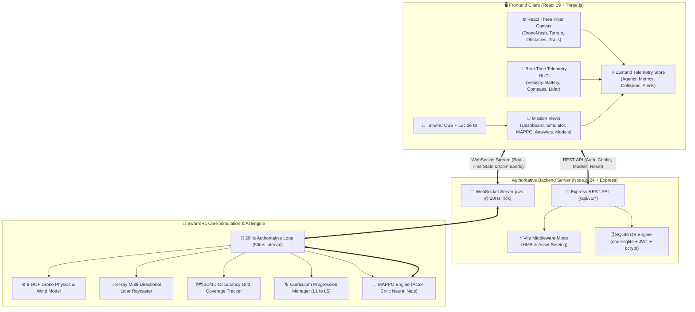
```mermaid
flowchart TB
    subgraph Client["🖥️ Frontend Client (React 19 + Three.js)"]
        UI["🎨 Tailwind CSS + Lucide UI"]
        Canvas3D["🌐 React Three Fiber Canvas\n(DroneMesh, Terrain, Obstacles, Trails)"]
        Zustand["⚡ Zustand Telemetry Store\n(Agents, Metrics, Collisions, Alerts)"]
        HUD["📊 Real-Time Telemetry HUD\n(Velocity, Battery, Compass, Lidar)"]
        Views["📑 Mission Views\n(Dashboard, Simulator, MAPPO, Analytics, Models)"]
        
        UI --> Views
        Canvas3D --> Zustand
        HUD --> Zustand
        Views --> Zustand
    end

    subgraph Server[" Authoritative Backend Server (Node.js 24 + Express)"]
        Express["🚀 Express REST API (/api/v1/*)"]
        WSS["📡 WebSocket Server (/ws @ 20Hz Tick)"]
        ViteMid["⚡ Vite Middleware Mode (HMR & Asset Serving)"]
        AuthDB["🗄️ SQLite DB Engine (node:sqlite + JWT + bcrypt)"]
        
        Express --> AuthDB
        Express --> ViteMid
    end

    subgraph CoreEngine["🧠 SwarmRL Core Simulation & AI Engine"]
        SimLoop["🔄 20Hz Authoritative Loop (50ms Interval)"]
        Physics["⚙️ 6-DOF Drone Physics & Wind Model"]
        Lidar["🔦 8-Ray Multi-Directional Lidar Raycaster"]
        Coverage["🗺️ 2D/3D Occupancy Grid Coverage Tracker"]
        Curriculum["🪜 Curriculum Progression Manager (L1 to L5)"]
        MAPPO["🧠 MAPPO Engine (Actor-Critic Neural Nets)"]
        
        SimLoop --> Physics
        SimLoop --> Lidar
        SimLoop --> Coverage
        SimLoop --> Curriculum
        SimLoop --> MAPPO
    end

    Client <==>|"WebSocket Stream (Real-Time State & Commands)"| WSS
    Client <==>|"REST API (Auth, Config, Models, Reset)"| Express
    WSS <==> SimLoop
    MAPPO <==> SimLoop
```

---

### 2. MAPPO Centralized Training & Decentralized Execution (CTDE)

SwarmRL follows the **Centralized Training with Decentralized Execution (CTDE)** paradigm. During decentralized execution, each drone agent chooses actions using **only** its private local observation. During training, a **Centralized Critic** observes the global state of the entire swarm to accurately evaluate state values and reduce policy gradient variance.

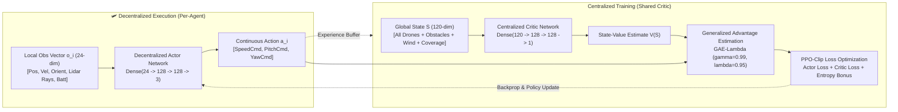
```mermaid
flowchart LR
    subgraph DecentralizedExecution["🛩️ Decentralized Execution (Per-Agent)"]
        Obs["Local Obs Vector o_i (24-dim)\n[Pos, Vel, Orient, Lidar Rays, Batt]"]
        Actor["Decentralized Actor Network\nDense(24 -> 128 -> 128 -> 3)"]
        Action["Continuous Action a_i\n[SpeedCmd, PitchCmd, YawCmd]"]
        
        Obs --> Actor --> Action
    end

    subgraph CentralizedTraining[" Centralized Training (Shared Critic)"]
        GlobalState["Global State S (120-dim)\n[All Drones + Obstacles + Wind + Coverage]"]
        Critic["Centralized Critic Network\nDense(120 -> 128 -> 128 -> 1)"]
        Value["State-Value Estimate V(S)"]
        GAE["Generalized Advantage Estimation\nGAE-Lambda (gamma=0.99, lambda=0.95)"]
        Loss["PPO-Clip Loss Optimization\nActor Loss + Critic Loss + Entropy Bonus"]
        
        GlobalState --> Critic --> Value
        Value --> GAE
        Action --> GAE
        GAE --> Loss
    end

    Action -.->|"Experience Buffer"| CentralizedTraining
    Loss -.->|"Backprop & Policy Update"| Actor
```

---

### 3. Continuous 3D Physics, Sensors & Environment Loop

The simulation loop ticks at **20Hz** (every 50 milliseconds) on the authoritative server:

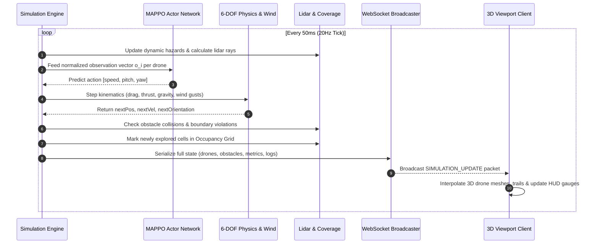
```mermaid
sequenceDiagram
    autonumber
    participant Engine as Simulation Engine
    participant MAPPO as MAPPO Actor Network
    participant Physics as 6-DOF Physics & Wind
    participant Sensors as Lidar & Coverage
    participant WSS as WebSocket Broadcaster
    participant UI as 3D Viewport Client

    loop Every 50ms (20Hz Tick)
        Engine->>Sensors: Update dynamic hazards & calculate lidar rays
        Engine->>MAPPO: Feed normalized observation vector o_i per drone
        MAPPO-->>Engine: Predict action [speed, pitch, yaw]
        Engine->>Physics: Step kinematics (drag, thrust, gravity, wind gusts)
        Physics-->>Engine: Return nextPos, nextVel, nextOrientation
        Engine->>Sensors: Check obstacle collisions & boundary violations
        Engine->>Sensors: Mark newly explored cells in Occupancy Grid
        Engine->>WSS: Serialize full state (drones, obstacles, metrics, logs)
        WSS-->>UI: Broadcast SIMULATION_UPDATE packet
        UI->>UI: Interpolate 3D drone meshes, trails & update HUD gauges
    end
```

---

### 4. Curriculum Learning Ladder (Levels 1 to 5)

The curriculum manager dynamically promotes the swarm through progressive operational challenges:

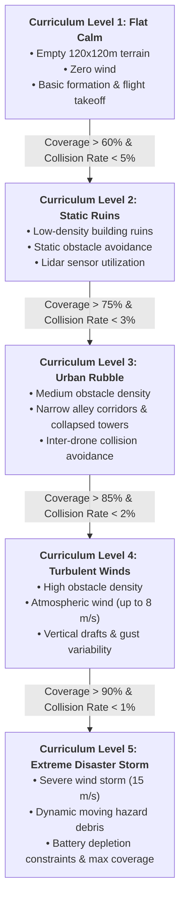
```mermaid
flowchart TD
    L1["<b>Curriculum Level 1: Flat Calm</b><br>• Empty 120x120m terrain<br>• Zero wind<br>• Basic formation & flight takeoff"]
    L2["<b>Curriculum Level 2: Static Ruins</b><br>• Low-density building ruins<br>• Static obstacle avoidance<br>• Lidar sensor utilization"]
    L3["<b>Curriculum Level 3: Urban Rubble</b><br>• Medium obstacle density<br>• Narrow alley corridors & collapsed towers<br>• Inter-drone collision avoidance"]
    L4["<b>Curriculum Level 4: Turbulent Winds</b><br>• High obstacle density<br>• Atmospheric wind (up to 8 m/s)<br>• Vertical drafts & gust variability"]
    L5["<b>Curriculum Level 5: Extreme Disaster Storm</b><br>• Severe wind storm (15 m/s)<br>• Dynamic moving hazard debris<br>• Battery depletion constraints & max coverage"]

    L1 -->|"Coverage > 60% & Collision Rate < 5%"| L2
    L2 -->|"Coverage > 75% & Collision Rate < 3%"| L3
    L3 -->|"Coverage > 85% & Collision Rate < 2%"| L4
    L4 -->|"Coverage > 90% & Collision Rate < 1%"| L5
```

---

### 5. Authoritative WebSocket Telemetry & Auth Lifecycle

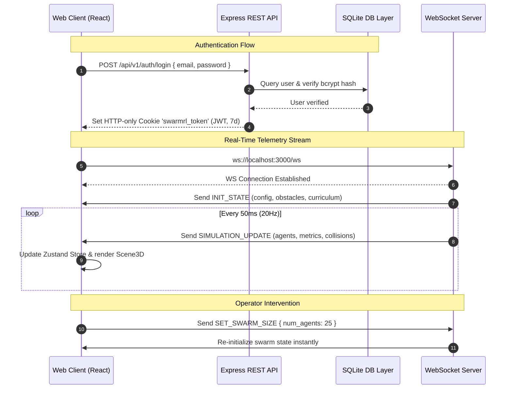
```mermaid
sequenceDiagram
    autonumber
    participant Browser as Web Client (React)
    participant Express as Express REST API
    participant DB as SQLite DB Layer
    participant WSS as WebSocket Server

    Note over Browser,DB: Authentication Flow
    Browser->>Express: POST /api/v1/auth/login { email, password }
    Express->>DB: Query user & verify bcrypt hash
    DB-->>Express: User verified
    Express-->>Browser: Set HTTP-only Cookie 'swarmrl_token' (JWT, 7d)

    Note over Browser,WSS: Real-Time Telemetry Stream
    Browser->>WSS: ws://localhost:3000/ws
    WSS-->>Browser: WS Connection Established
    WSS->>Browser: Send INIT_STATE (config, obstacles, curriculum)
    
    loop Every 50ms (20Hz)
        WSS->>Browser: Send SIMULATION_UPDATE (agents, metrics, collisions)
        Browser->>Browser: Update Zustand Store & render Scene3D
    end

    Note over Browser,WSS: Operator Intervention
    Browser->>WSS: Send SET_SWARM_SIZE { num_agents: 25 }
    WSS->>Browser: Re-initialize swarm state instantly
```

---

## 🖼️ Visual Showcase & Live Screenshots

High-resolution captures directly from the live platform:

| Section & Description | Live Preview Capture |
|---|---|
| **🌐 3D Disaster Simulation Laboratory**<br>Continuous 3D Three.js simulation viewport with disaster terrain, collapsed towers, ruins, dynamic hazard spheres, flight paths, real-time safety alert banners, and camera controls. | 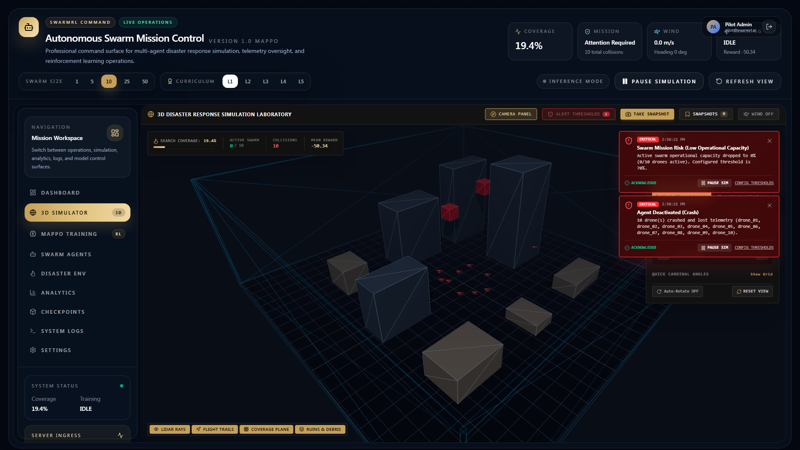 |
| **📊 Executive Mission Operations Dashboard**<br>Comprehensive mission control surface showing live simulation throughput (20 FPS), fleet readiness, coverage progress, and MAPPO inference status. | 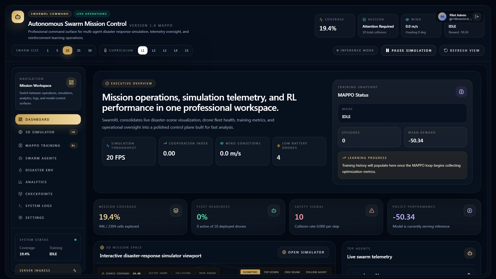 |
| **🧠 MAPPO Neural Training Control Center**<br>Actor-Critic convergence curves, Generalized Advantage Estimation (GAE-$\lambda$), surrogate & value loss monitoring, and estimated completion timer. | 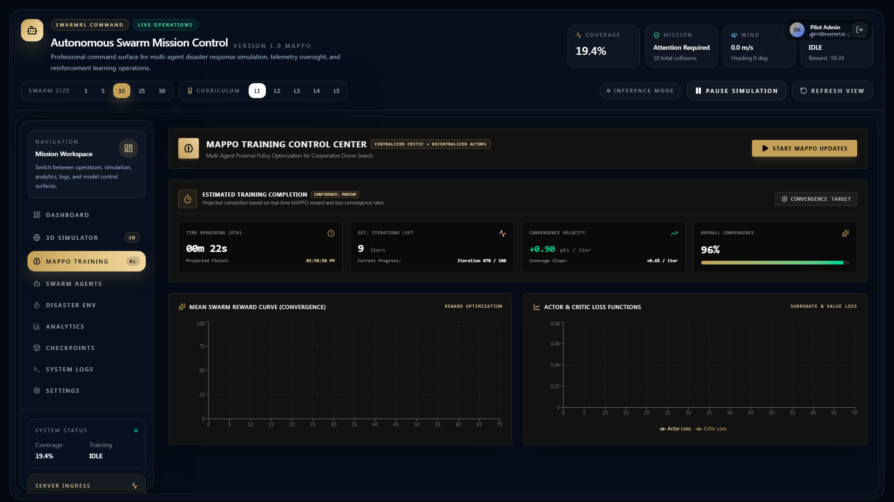 |
| **🤖 Swarm Drone Agent Fleet Inspector**<br>Real-time telemetry cards for each autonomous drone in the swarm, displaying 3D spatial velocity, battery level, distance travelled, and multi-ray lidar readings. | 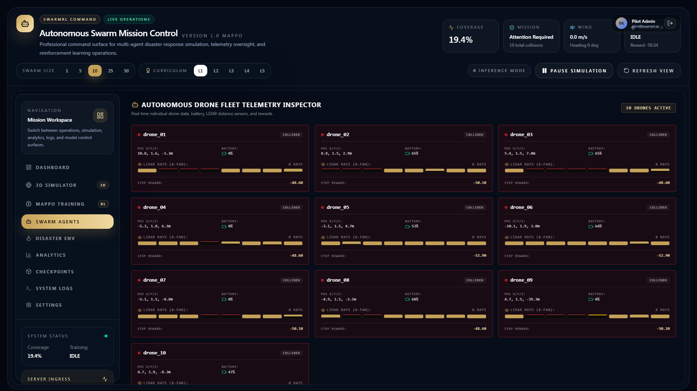 |
| **🌪️ Disaster Environment & Atmospheric Controls**<br>Real-time control over disaster zone dimensions, obstacle density, wind velocity, turbulence vectors, and dynamic hazards. | 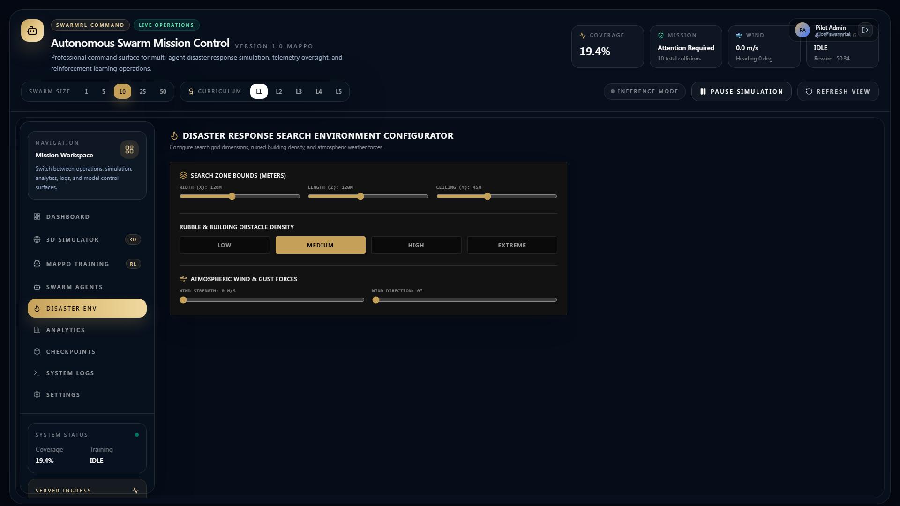 |
| **📈 Multi-Agent Telemetry & Analytics**<br>Recharts-powered mission coverage trends, collision frequencies, inter-drone coordination indices, and cumulative reward progression. | 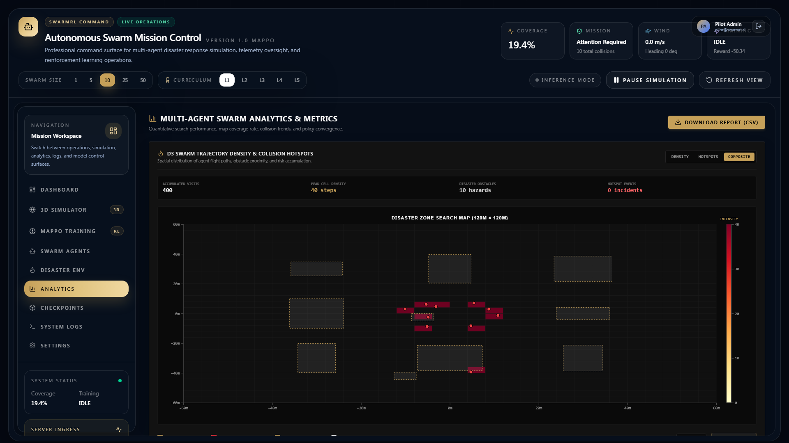 |
| **📦 Model Registry & Policy Checkpoints**<br>Pretrained and checkpointed MAPPO models across Curriculum levels L1 to L5 with benchmark ratings and configuration metadata. | 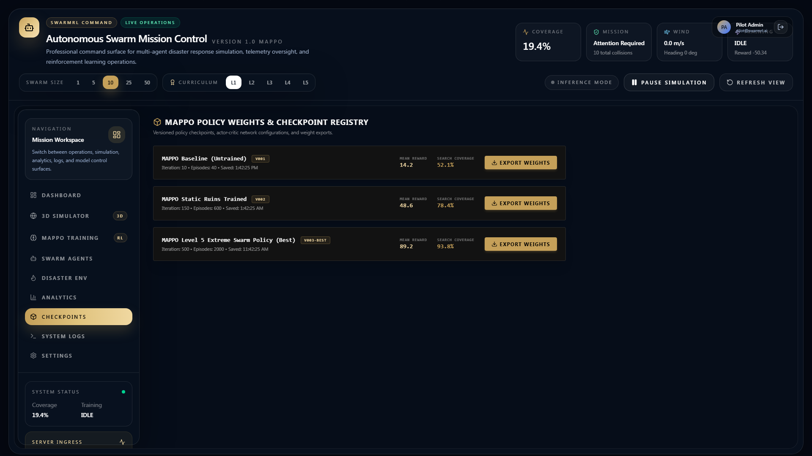 |
| **📋 System Event & Telemetry Logs**<br>Authoritative 20Hz event stream detailing WebSocket connections, collision alarms, and sensor alerts with live filtering. | 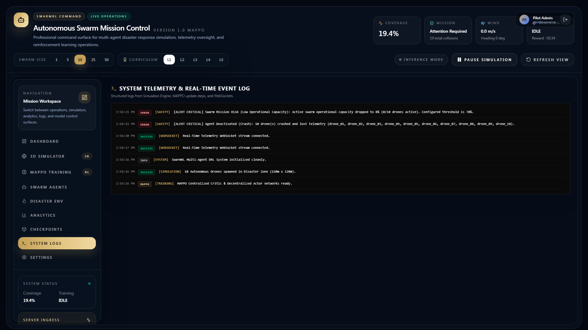 |
| **⚙️ Advanced Physics & Safety Settings**<br>Interactive controls for drone flight dynamics limits, lidar ranges, safety margins, and automated alert trip thresholds. | 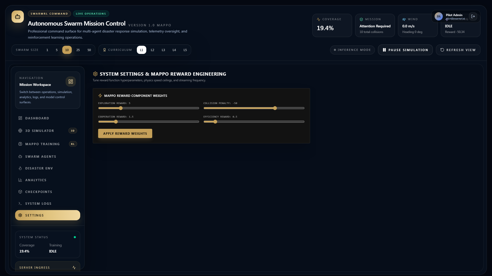 |
| **🚀 Enterprise Mission Landing Page**<br>High-contrast landing showcase detailing autonomous swarm capabilities, multi-agent coordination, and system specs. | 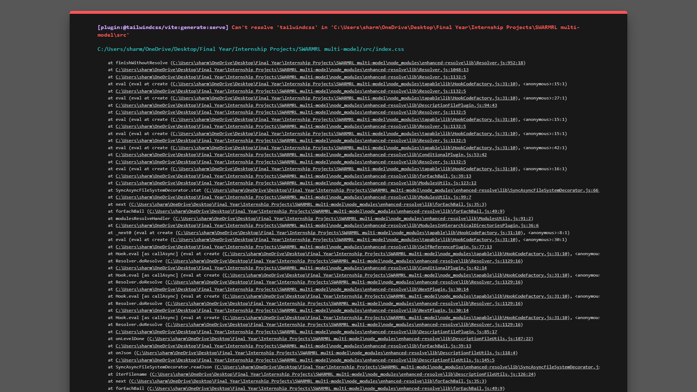 |
| **🔐 Pilot Authentication & Security**<br>Persistent SQLite authentication with password encryption, session recovery, and JWT token authorization. | 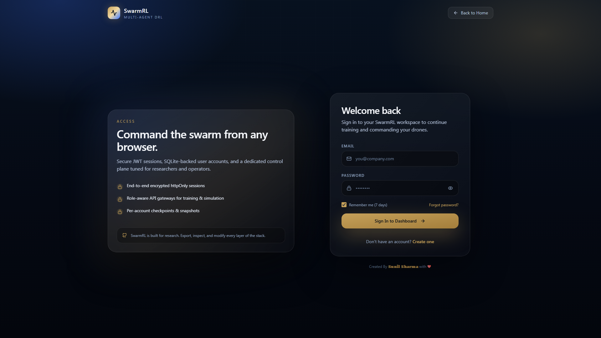 |

---

## 🧠 Deep Reinforcement Learning (MAPPO) Formulation

### 1. State & Observation Spaces

- **Decentralized Local Observation $o_i \in \mathbb{R}^{24}$**:
  $$\mathbf{o}_i = \left[ \mathbf{p}_i, \, \mathbf{v}_i, \, \boldsymbol{\theta}_i, \, \mathbf{d}_{\text{lidar}}, \, b_i, \, \Delta \mathbf{p}_{\text{center}} \right]$$
  where $\mathbf{p}_i = (x, y, z)$ is 3D normalized position, $\mathbf{v}_i$ is velocity, $\boldsymbol{\theta}_i = (\text{pitch}, \text{yaw}, \text{roll})$, $\mathbf{d}_{\text{lidar}} \in [0, 1]^8$ are normalized distance rays, $b_i$ is battery percentage, and $\Delta \mathbf{p}_{\text{center}}$ is displacement to swarm center of mass.

- **Centralized Global State $S \in \mathbb{R}^{120}$**:
  Concatenation of all active agents' states, global wind vector $\mathbf{w}$, obstacle density metrics, and total map coverage.

### 2. Policy & Value Network Architectures

- **Decentralized Actor Network $\pi_{\theta_i}(a_i | o_i)$**:
  - Input: $24$-dim local observation.
  - Hidden Layers: 2 layers $\times$ 128 units with Tanh non-linearities.
  - Output Head: Continuous 3-axis actions:
    $$\mathbf{a}_i = [\text{speedCmd}, \, \text{pitchCmd}, \, \text{yawCmd}] \in [-1, 1]^3$$
  - Action Log Probability under Gaussian policy with fixed variance $\sigma^2 = 0.15$:
    $$\log \pi(a_i | o_i) = -\frac{1}{2} \sum_{k=1}^3 \left[ \frac{(a_{i,k} - \mu_{i,k})^2}{\sigma^2} + \log(2\pi\sigma^2) \right]$$

- **Centralized Critic Network $V_\phi(S)$**:
  - Input: $120$-dim global state.
  - Hidden Layers: 2 layers $\times$ 128 units with Tanh activation.
  - Output Head: Scalar state-value estimate $V(S) \in \mathbb{R}$.

### 3. Objective & Loss Functions

- **Generalized Advantage Estimation ($\text{GAE}-\lambda$)**:
  $$\delta_t^V = r_t + \gamma V_\phi(S_{t+1}) (1 - d_t) - V_\phi(S_t)$$
  $$\hat{A}_t = \sum_{l=0}^\infty (\gamma \lambda)^l \delta_{t+l}^V$$
  where $\gamma = 0.99$ and $\lambda = 0.95$. Advantages are normalized per mini-batch: $\hat{A}_t^{\text{norm}} = \frac{\hat{A}_t - \mu_A}{\sigma_A + 10^{-5}}$.

- **PPO-Clipped Surrogate Actor Objective**:
  $$L^{\text{CLIP}}(\theta) = -\hat{\mathbb{E}}_t \left[ \min\left( r_t(\theta) \hat{A}_t^{\text{norm}}, \, \text{clip}(r_t(\theta), 1-\epsilon, 1+\epsilon) \hat{A}_t^{\text{norm}} \right) \right]$$
  where ratio $r_t(\theta) = \frac{\pi_\theta(a_t | s_t)}{\pi_{\theta_{\text{old}}}(a_t | s_t)}$ and $\epsilon = 0.20$.

- **Value Function Squared Error Loss**:
  $$L^{\text{VF}}(\phi) = \frac{1}{2} \hat{\mathbb{E}}_t \left[ \left( V_\phi(S_t) - \hat{R}_t \right)^2 \right]$$

- **Total MAPPO Loss**:
  $$L^{\text{TOTAL}} = L^{\text{CLIP}}(\theta) + c_1 L^{\text{VF}}(\phi) - c_2 \mathcal{S}[\pi_\theta](s_t)$$
  where $c_1 = 0.5$, $c_2 = 0.01$ (entropy bonus coefficient).

### 4. Multi-Objective Reward Function

$$R_i(t) = w_1 R_{\text{explore}} + w_2 R_{\text{cohesion}} + w_3 R_{\text{collision}} + w_4 R_{\text{boundary}} + w_5 R_{\text{energy}}$$

- $R_{\text{explore}} = +5.0$ upon discovering a previously unmapped cell in the occupancy grid.
- $R_{\text{cohesion}} = -\alpha \|\mathbf{p}_i - \bar{\mathbf{p}}_{\text{swarm}}\|$ penalizing dispersion beyond communication range.
- $R_{\text{collision}} = -50.0$ for colliding with buildings, ruins, or sibling drones.
- $R_{\text{boundary}} = -20.0$ for breaching the operational disaster bounding box.
- $R_{\text{energy}} = -0.02 \times \|\mathbf{v}_i\|^2$ promoting energy-conserving flight trajectories.

---

## 🎮 Continuous 3D Simulation & Physics Engine

1. **Kinematic Equations**:
   $$\mathbf{v}_{t+\Delta t} = \mathbf{v}_t + \left( \frac{\mathbf{F}_{\text{thrust}}}{m} + \mathbf{g} - \frac{1}{2} \rho C_d A \|\mathbf{v}_t - \mathbf{w}\|(\mathbf{v}_t - \mathbf{w}) \right) \Delta t$$
   $$\mathbf{p}_{t+\Delta t} = \mathbf{p}_t + \mathbf{v}_{t+\Delta t} \Delta t$$
2. **Atmospheric Wind Vector**:
   $$\mathbf{w}(t) = \mathbf{w}_{\text{base}} + \mathbf{w}_{\text{gust}} \sin(\omega t) + \mathbf{w}_{\text{draft}}$$
3. **Multi-Ray Lidar Sensor**:
   Casts 8 radial rays in horizontal and vertical planes at angles $\phi_k = \frac{2\pi k}{8}$ to a range of $25\text{ m}$. Computes line-segment intersections against all oriented 3D bounding boxes.
4. **Occupancy Grid**:
   Discretizes the $120\text{m} \times 120\text{m}$ area into $2.5\text{m}$ cells ($48 \times 48 = 2,304$ total cells). Tracks exploration timestamps, visit frequencies, and swarm coverage density.

---

## 🚀 Quick Start & Installation

### Prerequisites

- **Node.js** (v18 or higher; fully verified on Node.js v24 LTS)
- **npm** (v10 or higher)
- **Modern Browser** (Chrome, Edge, Firefox, Brave) with WebGL support

### 1. Clone the Repository

```bash
git clone https://github.com/sunbyte16/swarmrl-multi-model.git
cd swarmrl-multi-model
```

### 2. Configure Environment

Create your `.env` file from the provided template:

```bash
cp .env.example .env
```

Your `.env` file should contain:

```env
PORT=3000
NODE_ENV=development
JWT_SECRET=swarmrl-development-secret-key-2026-safe-local
GEMINI_API_KEY=""
APP_URL=http://localhost:3000
```

### 3. Install Dependencies

```bash
npm install
```

> **Note on SQLite**: The project utilizes Node.js's native `node:sqlite` (`DatabaseSync`), requiring **zero** external C++ build tools or Python node-gyp compilers.

### 4. Run the Development Platform

```bash
npm run dev
```

Open your browser to:
👉 **[http://localhost:3000](http://localhost:3000)**

### 5. Default Demonstration Credentials

You can sign in immediately using the pre-seeded account or register any new user on the `/register` page:

| Credential | Value |
|---|---|
| **Email** | `pilot@swarmrl.ai` |
| **Password** | `Password123!` |

---

## 💻 Mission Control Operations & UI Controls

Inside the **3D Simulator Laboratory** viewport:

### Camera Control Modes
- 🪐 **Orbit Camera**: Left-click and drag to rotate, right-click to pan, scroll to zoom.
- 🎯 **Chase Camera**: Automatically latches onto the selected drone, following its tail angle.
- 👁️ **Drone-POV Camera**: First-person perspective looking out from the drone's forward nose cone.
- 🗺️ **Bird's Eye**: Pure top-down orthographic mission space view.

### Layer Toggles
- 🔦 **Lidar Rays**: Toggle rendering of the 8 dynamic raycaster lines and collision hit sparks.
- ✈️ **Flight Trails**: Displays glowing 35-point historical ribbon paths for every active drone.
- 🗺️ **Coverage Plane**: Shows the real-time search-and-rescue occupancy grid plane.
- 🧱 **Ruins & Debris**: Toggles rendering of static collapsed towers and rubble geometries.
- 💨 **Wind Vectors**: Visualizes atmospheric wind direction and force vectors.

### Safety Alarms & Snapshot Drawer
- **Automated Alerts**: Generates audible and visual warnings when active swarm operational capacity drops below 70% or collisions occur.
- **Snapshot System**: Capture complete simulation states (agent coordinates, rewards, coverage percentage) to local storage and restore them at any time.

---

## 📡 REST API & WebSocket Telemetry Specification

### REST Endpoints (`/api/v1/*`)

| Method | Endpoint | Auth | Description |
|---|---|---|---|
| `GET` | `/api/v1/health` | Public | System uptime, version, and active WebSocket client count |
| `POST` | `/api/v1/auth/register` | Public | Register new pilot account with bcrypt password encryption |
| `POST` | `/api/v1/auth/login` | Public | Authenticate credentials and receive signed HTTP-only JWT cookie |
| `POST` | `/api/v1/auth/logout` | Public | Clears authorization session cookies |
| `GET` | `/api/v1/auth/me` | JWT | Fetch current authenticated user profile |
| `GET` | `/api/v1/simulation/state` | Public | Current simulation snapshot (agents, obstacles, metrics) |
| `POST` | `/api/v1/simulation/reset` | JWT | Reset simulation environment and respawn swarm in formation |
| `POST` | `/api/v1/simulation/config` | JWT | Update environment dimensions, obstacle density, or wind settings |
| `GET` | `/api/v1/training/status` | JWT | Retrieve current MAPPO iteration, loss trends, and history |
| `POST` | `/api/v1/training/start` | JWT | Begin continuous MAPPO policy updates |
| `POST` | `/api/v1/training/pause` | JWT | Pause neural policy gradient descent |
| `GET` | `/api/v1/models` | JWT | List checkpointed neural weights and benchmark ratings |

### WebSocket Protocol (`ws://localhost:3000/ws`)

1. **Client Connection Handshake**:
   Server responds with `INIT_STATE`:
   ```json
   {
     "type": "INIT_STATE",
     "config": { "width": 120, "length": 120, "height": 45, "num_agents": 10 },
     "obstacles": [ ... ],
     "curriculumLevel": 1
   }
   ```
2. **20Hz Telemetry Broadcast**:
   Server streams `SIMULATION_UPDATE` every 50ms:
   ```json
   {
     "type": "SIMULATION_UPDATE",
     "agents": [
       {
         "agent_id": "drone_01",
         "position": { "x": 12.4, "y": 8.2, "z": -4.5 },
         "velocity": { "x": 1.2, "y": 0.1, "z": 0.4 },
         "orientation": { "pitch": 0.04, "yaw": 1.57, "roll": 0.01 },
         "status": "SEARCHING",
         "battery": 94.2,
         "lidar_readings": [ 0.85, 1.0, 0.42, 1.0, 1.0, 0.91, 1.0, 1.0 ]
       }
     ],
     "metrics": {
       "fps": 20,
       "map_coverage_percent": 34.8,
       "active_agents": 10,
       "total_collisions": 0,
       "avg_reward": 14.2
     }
   }
   ```

---

## 📂 Project Directory Structure

```text
swarmrl-multi-model/
├── .env.example                 # Environment configuration template
├── images/                      # High-resolution application screenshots
│   ├── 01_landing_hero.png
│   ├── 04_login_page.png
│   ├── 06_dashboard_overview.png
│   ├── 07_3d_simulator_lab.png
│   ├── 08_mappo_training.png
│   ├── 09_swarm_agents.png
│   ├── 10_disaster_environment.png
│   ├── 11_analytics_telemetry.png
│   ├── 12_model_checkpoints.png
│   ├── 13_system_logs.png
│   └── 14_settings_view.png
├── index.html                   # Single-page application root HTML
├── package.json                 # Project dependencies and script runner
├── server.ts                    # Authoritative Node/Express/WebSocket server (20Hz)
├── tsconfig.json                # TypeScript compiler configuration
├── vite.config.ts               # Vite bundler & Tailwind CSS plugin configuration
└── src/
    ├── App.tsx                  # Top-level React Router layout & auth wrapper
    ├── DashboardApp.tsx         # Mission Control authenticated workspace shell
    ├── main.tsx                 # React 19 root bootstrap
    ├── components/
    │   ├── dashboard/           # Header, Sidebar, TelemetryHUD, StatusBadges
    │   ├── simulator/           # CameraControlPanel, SnapshotModal, SwarmAlertSystem
    │   ├── three/               # React Three Fiber (Scene3D, DroneMesh, Terrain, Trails)
    │   ├── training/            # EstimatedCompletionTimer, LossGraphs
    │   └── views/               # Dashboard, 3D Simulator, MAPPO, Agents, Analytics, etc.
    ├── lib/
    │   ├── authApi.ts           # Authentication fetch client
    │   ├── AuthContext.tsx      # React authentication state provider
    │   └── ProtectedRoute.tsx   # Session guard redirecting guests to /login
    ├── rl/
    │   ├── mappo.ts             # MAPPO Actor, Critic, GAE, PPO-Clip loss implementation
    │   └── trainer.ts           # Rollout orchestrator & checkpoint generator
    ├── server/
    │   └── db.ts                # SQLite database layer (node:sqlite + bcrypt)
    ├── simulation/
    │   ├── coverage.ts          # 2D/3D Occupancy Grid exploration tracker
    │   ├── curriculum.ts        # 5-stage curriculum learning manager
    │   ├── engine.ts            # Authoritative simulation tick & hazard manager
    │   ├── obstacles.ts         # Static ruins & dynamic hazard model
    │   ├── physics.ts           # 6-DOF drone kinematics, drag & wind gusts
    │   ├── rewards.ts           # Multi-objective reward engine
    │   └── sensors.ts           # Radial Lidar proximity sensor
    ├── stores/
    │   └── useSwarmStore.ts     # Zustand central telemetry store
    └── types/
        └── index.ts             # TypeScript interface declarations
```

---

## 🤝 Contributing & Development

Contributions, feature requests, and algorithmic improvements are welcome!

1. Fork the repository.
2. Create your feature branch (`git checkout -b feature/advanced-formation`).
3. Commit your changes (`git commit -m 'Add virtual spring-damper swarm formation'`).
4. Push to the branch (`git push origin feature/advanced-formation`).
5. Open a Pull Request.

---

## 📄 License

Distributed under the **MIT License**. See [`LICENSE`](LICENSE) for complete details.

---

## 👨‍💻 Author & Connect

<div align="center">

### **Crafted by 𝕊𝕦𝕟𝕚𝕝 𝕊𝕙𝕒𝕣𝕞𝕒**

*Deep Reinforcement Learning & Autonomous Robotics Specialist*

[](https://github.com/sunbyte16)
&nbsp;
[](https://www.linkedin.com/in/sunil-kumar-bb88bb31a/)
&nbsp;
[](https://lively-dodol-cc397c.netlify.app)

<br/>

**🔗 Direct Links:**
- **GitHub Profile**: [@sunbyte16](https://github.com/sunbyte16)
- **LinkedIn Profile**: [Sunil Kumar](https://www.linkedin.com/in/sunil-kumar-bb88bb31a/)
- **Personal Portfolio**: [lively-dodol-cc397c.netlify.app](https://lively-dodol-cc397c.netlify.app)

---

### ⭐ Show Your Support

If you found SwarmRL helpful for your research or projects, please consider **starring ⭐️ the repository**!

</div>
